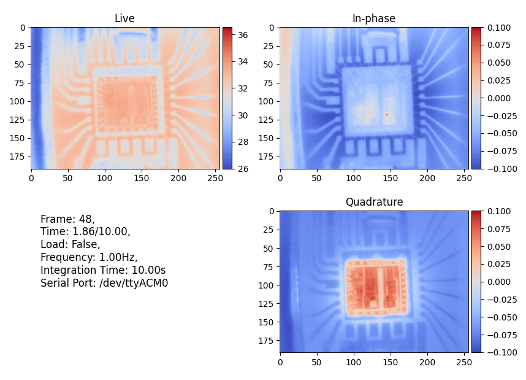

# ht301_hacklib
### Thermal camera python library

Supported thermal cameras:
- Hti HT-301
- Xtherm T3S, thanks to Angel-1024
- Xtherm T2L, T2S+, thanks to Christoph Mair and DiminDDL

It's a very simple hacked together lib, might be useful for somebody,  
uses `matplotlib` which is a little bit on the slow side,  
or pure `opencv` - much faster but without most features

Upon startup the app automatically looks for supported cameras by matching the resolutions.

```
python ./pyplot.py
keys:
    'h'      - help
    'q'      - quit
    ' '      - pause, resume
    'd'      - set diff
    'x','c'  - enable/disable diff, enable/disable annotation diff
    'f'      - full screen
    'u'      - calibrate
    't'      - draw min, max, center temperature
    'e'      - remove user temperature annotations
    'w'      - save to file date.png
    'r'      - save raw data to file date.npy
    ',', '.' - change color map
    'a', 'z' - auto exposure on/off, auto exposure type
    'k', 'l' - set the thermal range to normal/high (only for the TS2+)
    'o'      - change the camera orientation (rotate 90 degs CW). Only in OpenCV
    
    left, right, up, down - set exposure limits

mouse:
    left  button - add Region Of Interest (ROI)
    right button - add user temperature annotation
```

Alternatively you can specify the video device directly with `-d` to skip the search routine. 

Also for T2S+ V2 users (and potentially for others, where the camera sends raw data and doesn't do onboard processing resulting in the image looking like a pixelated mess) you can specify the `-r` option to tell the program to treat the camera stream as raw sensor data. This will perform a few calibration routines and present you with a usable image doing the sensor processing in python. There is also the `-o` parameter which adds an offset to the entire frames temperature values. This is useful for calibrating the camera since the raw mode sometimes ends up with a constant offset to the image, but this is specific to the camera and thus can be found once and then used for subsequent runs.

### Examples

Example that reads device `/dev/video14` in raw mode and adds an offset of -12.3 to the temperature values:

```
python ./pyplot.py -d /dev/video14 -r -o -12.3
```


View saved ('r' key) raw data file:
```
python ./pyplot.py 2022-09-11_18-49-07.npy
```

### Lock In Thermography

This feature allows you to use the camera in a lock-in mode. This allows for very precise measurements of hotspots on anything that can be modulated in some way. Examples include silicon dies, circuit boards, people (lock in based on heart rate) and potentially many others. 

As mentioned above the device under test needs to be stimulated on command from, the script sends commands into a provided serial port to do this.
A `1\n` indicates that we want to turn the modulation on, a `0\n` turns it off. The modulation frequency, serial port and integration time are all provided as command line arguments.

For example, the below command will use a modulation frequency of 1Hz, an integration time of 10s and send the commands to `/dev/ttyACM0`:

```
python ./pyplot.py -l 1 -p /dev/ttyACM0 -i 10
```

The modulation frequency should ideally be at least set 10x lower than the camera's frame rate, this is needed to get multiple samples as the sample heats up and cools down. The longer the integration time the more cycles will be "averaged" together, reducing noise, but the longer it takes to get a single frame. More info can be found in the paper linked below.



<br>

## Related projects

- https://gitlab.com/netman69/inficam
- https://github.com/MCMH2000/OpenHD_HT301_Driver
- https://github.com/sumpster/ht301_viewer
- https://github.com/cmair/ht301_hacklib
- https://github.com/mcguire-steve/ht301_ircam

## Related materials
- https://www.mdpi.com/1424-8220/17/8/1718
- https://www-old.mpi-halle.mpg.de/mpi/publi/pdf/540_02.pdf

